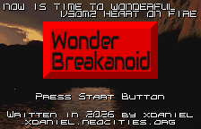
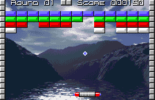
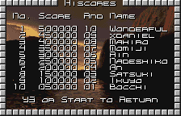

# Wonder Breakanoid

A work-in-progress "Breakanoid"-type game — i.e. a Breakout and/or Arkanoid clone — for the WonderSwan Color, written in C using the [Wonderful Toolchain](https://wonderful.asie.pl/).

## Screenshots

  
